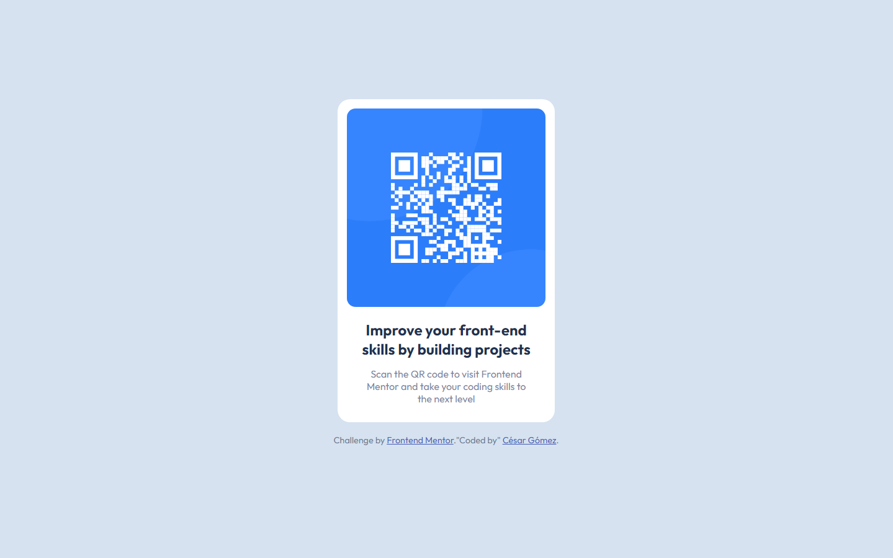

# Frontend Mentor - QR code component solution

This is a solution to the [QR code component challenge on Frontend Mentor](https://www.frontendmentor.io/challenges/qr-code-component-iux_sIO_H). Frontend Mentor challenges help you improve your coding skills by building realistic projects. 

## Table of contents

- [Overview](#overview)
  - [Screenshot](#screenshot)
  - [Links](#links)
- [My process](#my-process)
  - [Built with](#built-with)
  - [What I learned](#what-i-learned)
  - [Continued development](#continued-development)
  - [Useful resources](#useful-resources)
- [Author](#author)
- [Acknowledgments](#acknowledgments)


## Overview

### Screenshot



### Links

- Solution URL: [https://github.com/CaesarAlej24/QR-code-component](https://github.com/CaesarAlej24/QR-code-component)
- Live Site URL: [https://qr-code-component-f9qq4lrab-caesaralej24.vercel.app](https://qr-code-component-f9qq4lrab-caesaralej24.vercel.app)


## My process

### Built with

- Semantic HTML5 markup
- CSS custom properties
- Flexbox
- Mobile-first workflow


### What I learned

While doing this project i could learn about the basic workflow in a **CSS** layout, the basics of text-styles, and in the same way the principles of using *flex*. While was working in this project i could understand better the process and reinforce my own knowledge.

Some code that i used:

```html
<div class="container">
      
      <div class="text">
        <h1 class="title-text">Improve your front-end skills by building projects</h1>
      </div>
```
```css
.container {
    max-width: 320px;
    max-height: 800px;
    border-radius: 20px;
    display: flex;
    flex-flow: column;
    align-items: center;
    margin: auto;
    /* top | right | bottom | left */
    padding: 15px 1em 0 1em;
    background-color: hsl(0, 0%, 100%);
}
```

### Continued development

I want to focus on developing my programming and design skills through the use of the different tools and programming languages that exist, like **HTML** , **CSS** , **JavaScript** , **Python** , **NodeJs** , **PL/SQL** .

### Useful resources

- [Example resource 1](https://developer.mozilla.org) - This helped me for the first steps. I liked these documenting web technologies and will use it going forward.
- [Example resource 2](https://css-tricks.com) - This is an amazing collection of articles which helped me to understand **CSS** process. I'd recommend it to anyone still learning *CSS*.

## Author

- Website - [CésarGómez](https://www.your-site.com)
- Frontend Mentor - [@CaesarAlej24](https://www.frontendmentor.io/profile/CaesarAlej24)
- Twitter - [@yourusername](https://www.twitter.com/yourusername)

## Acknowledgments

For all the help that i received clarifying doubts for the elaboration of this project, i want to give some credits to **@ChamuMutezva**, **@ACamariana**. 

